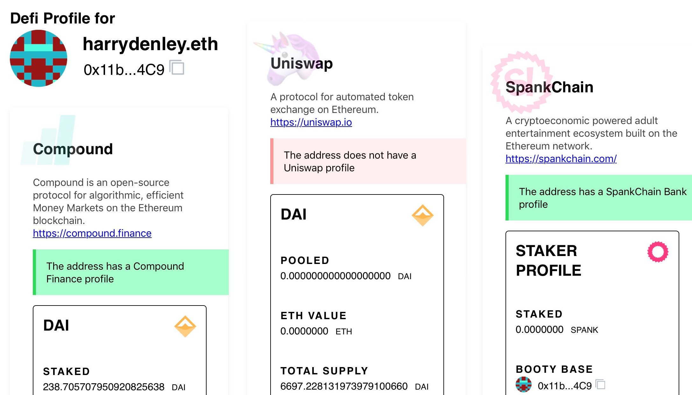

# Defiscan

This is a simple UI to get a current snapshot of any address for certain defi protocols. Currently it supports;

* Compound Finance
* Uniswap
* Spankchain Bank

This was a quick rush job so code architecture is probably not great but it works and that was my goal, heh.

### Deployment

* To develop, run `yarn start` and you'll get a development server running with live changes.
* To build production, run `yarn build` and push the `build/*` directory to `gh-pages` branch.

### Branching Model

The main branch is `master`. 
 - Branch off it and issue a PR into `master` branch.
 - Preferrably prefix your branch with `ft-` (feature), `en-` (enhancement), `bf-` (bugfix), `hf-` (hotfix)

Production is `yarn build` on the `gh-pages` branch.